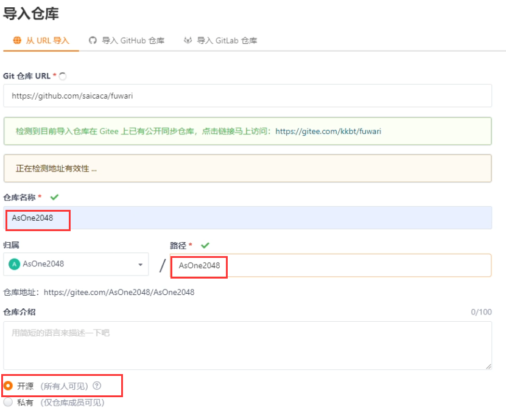
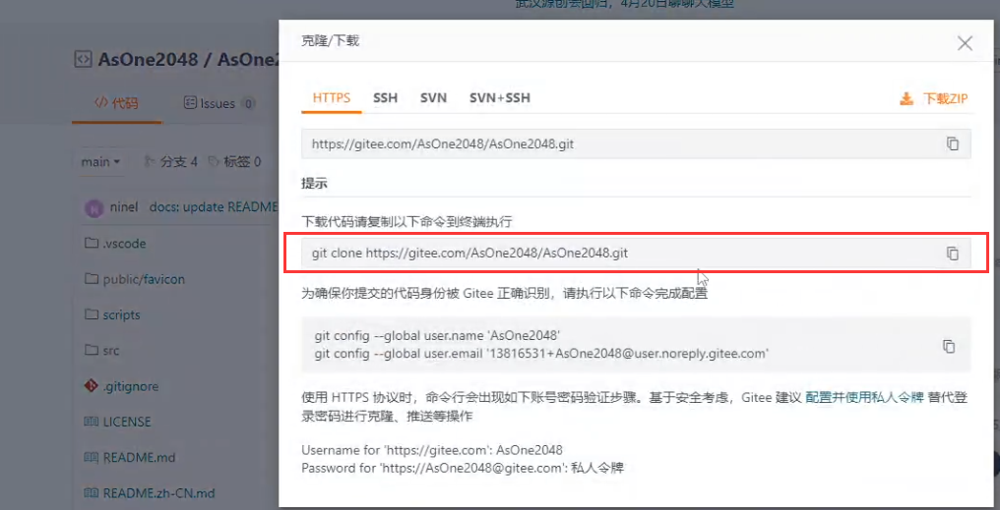

---

title: Fuwari博客Gitee部署
published: 2024-04-18
description: '使用Gitee Pages部署基于Astro的Fuwari静态博客'
image: ''
tags: [Fuwari, Astro ]
category: '前端'
draft: false 

---
## 一、导入项目到Gitee
##### Fuwari Github项目：https://github.com/saicaca/fuwari/
##### 将Fuwari Github项目导入到gitee
##### **注意！仓库及路径需和用户名相同！项目必须开源！**

## 二、克隆项目到本地
##### 可以使用git clone项目到本地，当然使用其他IDE的VCS也可以

## 三、安装依赖
##### 依次使用`pnpm install`和 `pnpm add sharp` 安装依赖
## 四、修改配置
### 1、.gitignore
##### 删除 `dist/` 一行
### 2、astro.config.mjs
##### 将site改为你的网站地址
##### 默认为https://<用户名>.gitee.io/（如https://asone2048.gitee.io/）
### 3、src/config.ts （可选）
##### 修改网站语言 可将lang改为zh_CN
## 五、构建部署
### 1、构建项目
##### 使用`pnpm run build`构建项目
### 2、提交更改
将相关更改提交到gitee远程仓库
### 3、部署网页
##### 在项目远程仓库的服务一栏，进入Gitee Pages
##### 部署分支选择main
##### 部署目录输入`dist`
##### 等待部署完成后，可通过https://<用户名>.gitee.io/（如https://asone2048.gitee.io/） 访问你的网站
## 六、相关命令
| 命令                              | 操作      |
|:------------------------------- |:------- |
| `npm install pnpm -g`           | 安装pnpm  |
| `pnpm install` `pnpm add sharp` | 安装依赖    |
| `pnpm run build`                | 构建项目    |
| `pnpm run dev`                  | 开发者模式运行 |
| `pnpm run preview`              | 本地预览    |
| `pnpm new-post <filename>`      | 新建一篇文章  |
